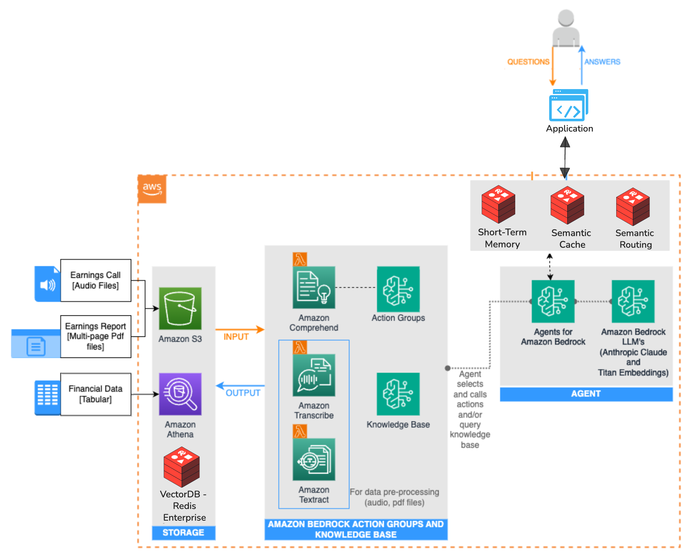

# Redis-Enhanced AWS Bedrock Agent

Demonstrates the technical impact of integrating Redis Enterprise with AWS Bedrock Agents through a side-by-side architecture comparison. This implementation measures performance improvements from semantic caching, conversation memory, and intelligent query routing.



## Prerequisites

- Python 3.8+
- AWS Account with Bedrock enabled
- Redis Enterprise Cloud account

## Installation

```bash
git clone https://github.com/Redislabs-Solution-Architects/redis-aws-investment-analyst.git
cd redis-aws-investment-analyst
pip install -r requirements.txt
```

## Setup

### Step 1: AWS Foundation Setup◊
Deploy the baseline AWS architecture using the official sample repository:

[AWS Bedrock Investment Research Sample](https://github.com/aws-samples/amazon-bedrock-samples/tree/main/agents-and-function-calling/bedrock-agents/use-case-examples/ai-powered-assistant-for-investment-research)

This establishes: S3 bucket with financial documents, OpenSearch knowledge base, and a functional Bedrock agent. Record the agent ID for configuration.

### Step 2: Redis Integration

#### 2a. Redis Database
1. Create Redis Enterprise database with Vector Search module and TLS encryption enabled
2. Record connection parameters: host, port, password
3. Download TLS certificates to `certs/` directory with these exact filenames:
   - CA certificate → `certs/redis_ca.pem`
   - Client certificate → `certs/client-cert.pem`
   - Client key → `certs/client-key.pem`

#### 2b. Redis Knowledge Base
1. Create new knowledge base in AWS Bedrock console
2. Configure with identical S3 bucket from Step 1
3. Select Redis as vector database (instead of OpenSearch)
4. Configure Redis connection parameters and TLS certificates
5. Execute knowledge base synchronization

#### 2c. Redis Agent
1. Create new Bedrock agent with identical configuration to OpenSearch agent
2. Associate with Redis knowledge base from Step 2b
3. Record the Redis agent ID for application configuration

### Step 3: Configure Credentials
```bash
cp setup.sh.example setup.sh
chmod +x setup.sh
nano setup.sh  # Fill in your credentials:
```

```bash
# AWS
export AWS_ACCESS_KEY_ID="AKIA..."
export AWS_SECRET_ACCESS_KEY="..."
export AWS_REGION="us-west-2"
export BEDROCK_AGENT_ID_REDIS="your-redis-agent-id"      # From Step 2c
export BEDROCK_AGENT_ID_OPENSEARCH="your-opensearch-agent-id" # From Step 1

# Redis
export REDIS_HOST="redis-12345.c1.us-west-2.ec2.cloud.redislabs.com"
export REDIS_PORT="12345"
export REDIS_PASSWORD="your-password"

# TLS Certificates (required for Bedrock integration)
export REDIS_CA_CERT="./certs/redis_ca.pem"
export REDIS_CLIENT_CERT="./certs/client-cert.pem"
export REDIS_CLIENT_KEY="./certs/client-key.pem"
```

### Step 4: Run
```bash
./setup.sh
```

Access `http://localhost:8000` to interact with both architectures simultaneously and compare performance metrics.

**Enhanced (Redis + AWS)**
```
Query → Semantic Router → Cache/Memory → Bedrock Agent → Redis VectorDB
```

**Standard (AWS Only)**  
```
Query → Bedrock Agent → OpenSearch
```

## Configuration

### Performance Tuning
```python
# config.py
SIMILARITY_THRESHOLD = 0.8      # Cache strictness (higher = more strict)
MEMORY_THRESHOLD = 0.15         # Memory recall (lower = more recall)  
CACHE_TTL = 86400              # Cache TTL (seconds)
MEMORY_TTL = 604800            # Memory TTL (seconds)
```

## Code Structure

```
├── app.py                 # FastAPI application
├── config.py              # Configuration management
├── redis_integration.py   # Redis Enterprise features
├── bedrock_service.py     # AWS Bedrock abstraction
├── index.html             # Comparison UI
├── setup.sh               # Environment setup
└── certs/                 # Redis TLS certificates
```

## Test Queries

**Short-Term Memory**
```  
1. "My name is yusuf" (stored in session memory)
2. "What is my name?" (retrieved from session context)
3. "Focus on 2021 financial data"
4. "what were the net sales?" (will pull 2021 net sales)
```

**Semantic Caching**
```
5. "What were the sales figures??" 
```

**Semantic Routing**
```
6. "How do I cook Pasta?" (filtered out)
```
